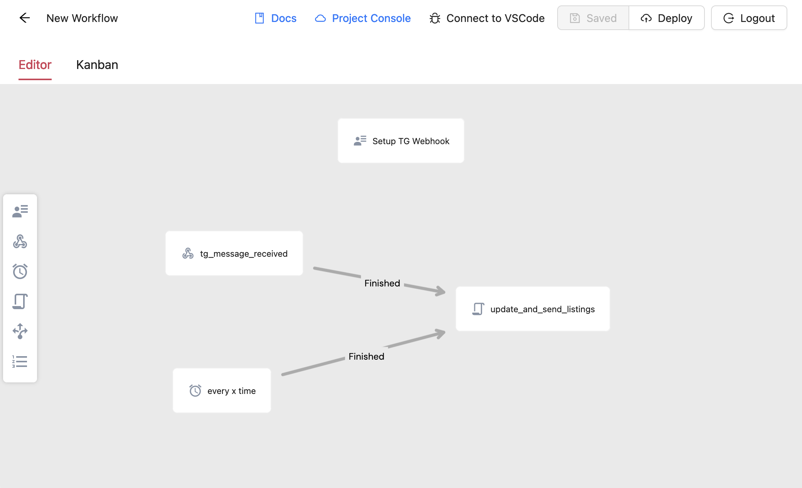

# SextoAndar

Telegram bot to notify about new listings for a given search on Zap Imóveis.

It will perform a search every x time or by request.

Made with Python and [Abstra](https://github.com/abstra-app/abstra-lib).

#### Disclaimers

> ⚠️ This is a personal project, I'm not affiliated with Zap Imóveis in any way.

> ⚠️ Use at your own risk, querying Zap Imóveis APIs directly may be against their terms of use.

## Usage

### Getting the query

> _still working on a better way to do this, but it's only done once_

- Make your search on Zap Imóveis
- Open developer tab and search for `glue` on the network tab
- Scroll down until you find a request with `glue` on the name


- Copy the request and replace the fields on `zap.py` 

### Creating the Telegram Bot

- Create a new bot with [BotFather](https://t.me/botfather)
- Copy the token and save it for the next step

### Environment

- Create a `.env` file on the root:
  ```
  TG_OWNER_CHAT_ID=
  TG_BOT_TOKEN=
  TG_WEBHOOK_TOKEN=
  ADMIN_EMAIL=
  ```

- `TG_BOT_TOKEN` is the token you got from BotFather

- `TG_OWNER_CHAT_ID` is the chat id of the user that will receive the notifications, you may use check the logs and fill it after the first run

- `TG_WEBHOOK_TOKEN` is a random string used to secure the webhook

- `ADMIN_EMAIL` is the email of the admin of the bot

### Running local editor



- This is a project made with [Abstra](https://github.com/abstra-app/abstra-lib)
- Install the requirements with `pip install -r requirements.txt`
- Run the server with `abstra serve`
- Deploy it using the UI

### Setting up cloud console
- Set the same environment variables on the Cloud Console UI
- Find the public url of the admin form, login with the admin email and set the webhook
- Create two tables with the following schemas:
  - `listings_urls` to store the urls of the listings already sent
    - `url` (varchar, unique, not nullable)
    - `zap_id` (varchar, unique, not nullable)
  - locks to avoid multiple instances of the bot
    - `chat_id` (varchar, unique, not nullable)

- Send a message to the bot to test it

### Customizing

- You may change the interval of the search by editing the "Job" on the UI
- Search for `send_message` to customize the messages sent to the user


